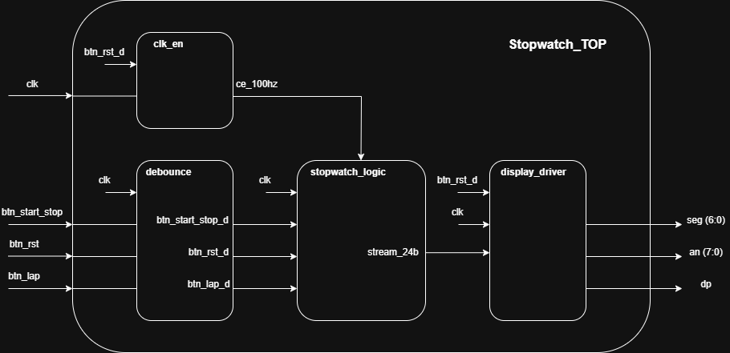
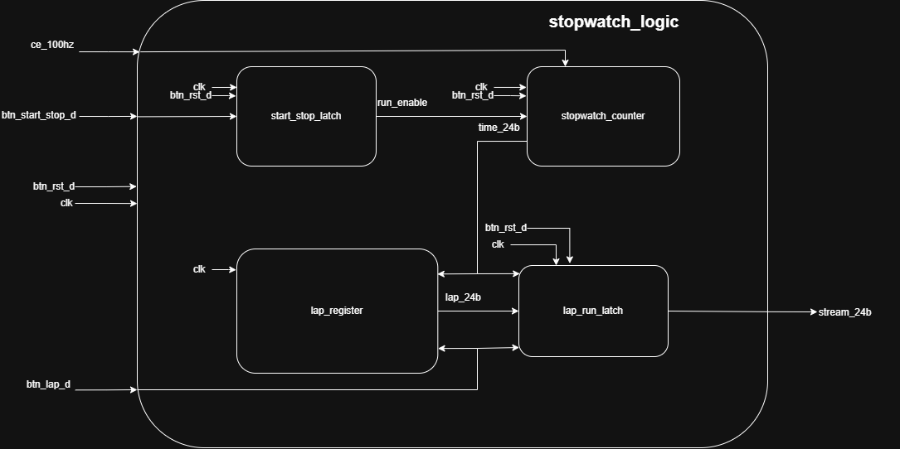

# Projekt: Digitální stopky s funkcí Lap (mezičas)

Tento projekt implementuje digitální stopky na desku Nexys A7-50T v jazyce VHDL. Stopky měří čas s přesností na setiny sekundy do hodnoty `59:59.99` a umožňují zmrazení zobrazení (Lap) bez přerušení měření na pozadí.

# Hlavní funkce
**Start a Stop:** spuštění nebo pozastavení měření času.
**Lap (mezičas):** zmrazení aktuálního času na displeji. Pokud je funkce Lap aktivování, svítí na levém krajním displeji písmeno `L`. Vnitřní čítač stále běží a čítá dále.
**Reset:** Vynulování stopek.

---

# Členové týmu
- **Ondrej Kollár**
- **Lukáš Kosek**
- **Antonín Pohanka**

---

# Harmonogram
1. **týden**
  - blokové schéma logiky projektu, vytvoření github stránky
 
    
2. **týden**
  - vývoj jednotlivých bloků, simulace v programu Vivado
 
    
3. **týden**
  - spojení modulů do finálního celku, první testování programu na hardware
 
    
4. **týden**
  - funkční výrobek, optimalizace, debug; github dokumentace
 
    
5. **týden**
  - dokončení, prezentační video a plakát funkčního zařízení

---

# Blokové schéma projektu

### Schéma z pohledu stopwatch_top

 
 

### Vnitřní logické schéma stopwatch_logic

<?xml version="1.0" encoding="UTF-8"?>

---

## Popis vstupů

- `btn_start_stop`: Tlačítko sloužící k zapnutí či pozastavení stopek (počítání času).
- `btn_rst`: Tlačítko sloužící k vyresetování stopek a nastavení času na nulu.
- `btn_lap`: Tlačítko sloužící pro zobrazení času kola. V podstatě zmrazení času na displeji, přičemž na pozadí se čas přičítá dále, pokud se nezastaví. Jakmile se tlačítko zmáčkne znovu, začne se opět zobrazovat běžící čas, který se zatím přičítal "na pozadí".
- `clk`: Hodinový vstup z desky Nexys A7-50T.
- `ce_100hz`: Upravený časový signál sloužící k přičítání času na stopkách.
- `(...)_d`: Ošetřené vstupy blokem debounce.

---

## Popis jednotlivých modulů programu

* `stopwatch_top.vhd` (Top-Level): Propojuje fyzické vstupy z tlačítek s debouncery a rozvádí signály do hlavní logiky a displeje.
* `clk_en.vhd`: Dělič frekvence. Ze 100MHz systémových hodin generuje pulz o frekvenci 100 Hz pro počítání setin sekundy.
* `debounce.vhd`: Filtr mechanických zákmytů tlačítek. Na výstupu generuje čistý pulz o délce přesně jednoho hodinového taktu.
* `display_driver.vhd`: Zpracovává 32bitový vstupní vektor. Obsahuje rychlý čítač pro multiplexování 8 anod, dekodér z BCD formátu na 7 segmentů (včetně znaku `L`) a logiku pro statické zobrazení desetinných teček.

**Submoduly hlavní logiky (`stopwatch_logic.vhd`):**
Tento modul slouží jako black box pro 4 menší logické bloky, které řídí běh stopek:
1. `start_stop_latch.vhd`: Klopný obvod uchovávající informaci, zda stopky aktuálně běží nebo jsou pozastaveny.
2. `stopwatch_counter.vhd`: Samotný kaskádový BCD čítač. Počítá setiny, sekundy a minuty na základě 100Hz pulzu.
3. `lap_run_latch.vhd`: Řadič režimu Lap. Přepíná, zda se na displej posílá běžící čas, nebo zmrazený čas. Současně dává signál pro zobrazení písmene `L`.
4. `lap_register.vhd`: Paměťový registr. Dokud není aktivní režim Lap, přepisuje se aktuálním časem. Jakmile se Lap aktivuje, hodnota v něm "zamrzne".

---

## Simulace

**Popis simulace:**
1. Počáteční reset vynuluje všechny registry.
2. Stisk `btn_start_stop` spustí hlavní čítač, čas začíná plynule narůstat (viditelné na signálu `time_24b`).
3. Stisk `btn_lap` aktivuje režim mezičasu. Na výstupu pro displej se čas zastaví na hodnotě `000104` (viditelné na `lap_24b`), ale vnitřní čítač běží dál.
4. Následující stisk `btn_lap` vrátí na displej opět aktuálně běžící čas.
5. Opětovný stisk `btn_start_stop` stopky zcela zastaví (to už se do obrázku nevešlo).
